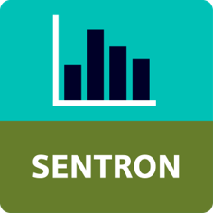
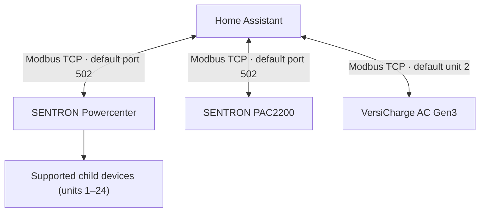

<p align="center">
  
</p>

# Siemens SENTRON for Home Assistant

<p align="center">
  Local monitoring and carefully guarded control of selected Siemens SENTRON and VersiCharge devices over Modbus TCP.
</p>

<p align="center">
  <a href="https://github.com/powerassistant/ha-siemens-sentron/releases/latest"></a>
  <a href="https://github.com/powerassistant/ha-siemens-sentron/actions/workflows/validate.yml"></a>
  <a href="https://www.hacs.xyz/docs/faq/custom_repositories/"></a>
  <a href="LICENSE"></a>
</p>

Current release: `V26.09.08`

Requires Home Assistant `2026.8.0` or newer. The release workflow validates
runtime imports against Home Assistant `2026.8.3`, Python `3.14.2` and
`pymodbus 3.13.1`.

> [!WARNING]
> This integration can expose commands that operate connected electrical
> devices. It is not a protective device, safety function, billing meter or
> substitute for commissioning by qualified personnel. Keep Modbus TCP on a
> trusted local network and verify every command on the physical installation.

## What you can do

- Monitor current, voltage, active/reactive/apparent power, energy, frequency
  and power factor where the detected device provides them.
- View breaker state, alarm state, connection state, temperature, operating
  hours, radio diagnostics and device identification where supported.
- Discover supported Powercenter child devices automatically on Modbus unit
  IDs 1–24 and represent each one as a separate Home Assistant device.
- Monitor a standalone VersiCharge AC Gen3, including charging energy, live
  active power, electrical measurements, charging state and diagnostics.
- Add suitable active-energy sensors to the Home Assistant Energy Dashboard.
- Control a VersiCharge from Home Assistant through a disabled-by-default
  `0.1 kW` active-power target, pause/resume switch and fallback entities. The
  target is converted once at nominal `230 V` and the reported charger phase
  type, then rounded to a whole-ampere charger command.
- Use switching, testing and configuration entities on supported devices.
  Write-capable entities are disabled by default and require deliberate
  enabling in Home Assistant.
- Operate locally without a cloud account, with English and German UI text.

Available measurements and controls depend on the device type and firmware.
The integration creates only the capabilities defined for the detected profile.

## Compatibility

### Root devices

| Device | Connection | Child discovery | Main capabilities |
| --- | --- | --- | --- |
| SENTRON Powercenter 1000 | Modbus TCP | Yes, units 1–24 | Gateway diagnostics and supported connected-device profiles |
| SENTRON Powercenter 1100 | Modbus TCP | Yes, units 1–24 | Gateway diagnostics and supported connected-device profiles |
| SENTRON Powercenter 2000 | Modbus TCP | Yes, units 1–24 | Gateway diagnostics and supported connected-device profiles |
| SENTRON PAC2200 | Modbus TCP, standalone | No | Current, voltage, power, energy, frequency, power factor and diagnostics |
| VersiCharge AC Gen3 | Modbus TCP, standalone | No | Charging energy and power, current/voltage/power-factor measurements, state, diagnostics and guarded charging control |

### Supported Powercenter child devices

- 5ST3 COM AS+FC
- 5SL6 COM MCB
- 5SL6 COM MCB RCM
- 5SV6 COM AFDD
- 5SV8 COM RCM
- 5ST3 COM RCA Standard
- 5ST3 COM RCA with RCD/IR Test
- 3RV2 COM MSP
- 5TY1 COM ECPD
- 5TT4 COM DIDO

"Supported" here means that a software profile is present. Hardware and
firmware combinations should still be validated before use on a production
installation. See [known limitations](docs/KNOWN_LIMITATIONS.md).

## How it connects



## Preparation

Before installing the integration:

1. Enable Modbus TCP according to the applicable device documentation. On a
   VersiCharge, Modbus is disabled by default on current firmware; the charger
   must be commissioned and Modbus enabled through Sifinity Go or Siemens
   Support before Home Assistant can connect.
2. Give the device a stable IP address or DHCP reservation.
3. Keep the default port `502`, or note the configured alternative.
4. Confirm that Home Assistant can reach the device on that TCP port.
5. Restrict Modbus TCP to a trusted, segmented local network. Never forward
   port 502 from the internet.
6. Avoid multiple clients polling the device faster than its supported
   connection and request limits.

No register addresses need to be entered manually. A Powercenter entry
discovers supported child devices; PAC2200 and VersiCharge entries are
standalone. VersiCharge detection starts at unit ID `2` and automatically tries
unit ID `1` as a fallback. A different unit ID can be entered during setup.

## Installation with HACS

[](https://my.home-assistant.io/redirect/hacs_repository/?owner=powerassistant&repository=ha-siemens-sentron&category=integration)

Until this repository is accepted into the default HACS catalog, add it as a
custom repository:

1. Open HACS in Home Assistant.
2. Open the menu and select **Custom repositories**.
3. Enter `https://github.com/powerassistant/ha-siemens-sentron`.
4. Select **Integration** and add the repository.
5. Select **Siemens SENTRON**, choose release `V26.09.08` and download it.
6. Restart Home Assistant.

## Add the integration

1. Open **Settings → Devices & services**.
2. Select **Add integration** and search for **Siemens SENTRON**.
3. Enter the stable IP address or host name and the Modbus TCP port (normally
   `502`). Do not include `http://` or `https://`.
4. After the connection succeeds, assign the root and discovered devices to
   Home Assistant areas as required.

Only one config entry can use the same host-and-port combination.

## Manual installation

Copy `custom_components/siemens_sentron` into the `custom_components` directory
of the Home Assistant configuration directory, restart Home Assistant, and add
the integration from the UI. HACS is recommended because it also manages
updates and release selection.

## Add energy to the Energy Dashboard

1. Open **Settings → Dashboards → Energy**.
2. Under the appropriate energy source, select **Add consumption**,
   **Add grid consumption** or **Add solar production**.
3. Select an active-energy entity with unit `kWh` and a total-increasing state,
   such as an active import or export total supported by the device.
4. Save and allow Home Assistant time to collect statistics.

Reactive energy (`kvarh`) and apparent energy (`kVAh`) are intentionally not
declared as Home Assistant active-energy entities.

For VersiCharge, select **Total charged energy** (`kWh`, total increasing) as
the consumption energy entity. **Charging power** (`W`) supplies live charging
power for dashboards and automations. The integration filters isolated counter
drops and restores its guard state across integration reloads before publishing
values to Home Assistant statistics.

## VersiCharge PV-surplus control

VersiCharge accepts a current command, not a native watt command. The
integration therefore provides one virtual active-power target in `kW` with a
`0.1 kW` step. Each service call converts the target once at nominal `230 V`
and the reported charger phase type, rounds to a whole ampere and writes that
value exactly once. Live voltage and power factor remain monitoring values and
never feed back into the target. The physical minimum is `6 A`, approximately
`1.38 kW` for a charger reported as one-phase or `4.14 kW` for one reported as
three-phase at nominal voltage.

To prevent a Home Assistant service-task backlog, a concurrent charging
command is rejected instead of queued. Power-target writes and resume starts
are rate-limited to one per five seconds; pause and fallback may bypass that
interval but never the concurrent-command guard. Local-only target changes are
throttled separately and do not delay an immediate resume. No delayed immediate
readback or automatic retry is used, and the normal ten-second polling path is
read-only. The separate charging switch pauses with `0 A` and resumes the
remembered kW target. The former direct current target is no longer exposed as
a writable entity.

The phase-mode register is read-only on firmware `2.135` and newer. This
integration uses its stable charger-type value for conversion. Current samples
cannot change a command between one and three phases, and the integration does
not promise or emulate automatic 1/3-phase switching. See the
[VersiCharge guide](docs/VERSICHARGE.md) for the calculation, a Home Assistant
automation example, firmware differences and operational limits.

## Updates and entity IDs

- Create a Home Assistant backup before updating the integration.
- HACS installs published GitHub releases; restart Home Assistant after an
  update.
- Fresh installations use collision-free English entity IDs scoped to the
  config entry and device, including the Modbus `unit_id`.
- Existing entity IDs, including user-customized IDs, are never renamed
  automatically. Review automations, scripts and dashboards before changing an
  ID manually.

## Write controls and operational safety

- All write-capable switches, buttons, numbers and selects are disabled by
  default. Enable only the individual entity you need and have tested.
- VersiCharge power-target, pause/resume and fallback controls are disabled by
  default. A write is accepted only after a positive Modbus acknowledgement;
  independent register feedback arrives with the next normal read-only poll.
- For PV-only operation, `0 A` fallback current with a `60 s` fallback time is
  the recommended fail-safe starting point. These values are not persistent in
  the charger and must be checked again after a restart or power cycle.
- An OCPP backend or cloud-side charging limit can override or compete with a
  Modbus command. Always base automation feedback on measured charger power,
  not the requested setpoint alone.
- The ECPD permanent-disconnect button is disabled by default. Enabling and
  pressing it can irreversibly disconnect the device.
- A Home Assistant state is never sufficient proof that an electrical circuit
  is safe to work on.
- Validate firmware compatibility, command effects, negative paths and readback
  on an isolated, non-critical installation.
- Read the full [safety and legal notice](DISCLAIMER.md) before use.

## Troubleshooting

1. Confirm that the device is reachable from Home Assistant on the configured
   TCP port.
2. Ensure no other Modbus client is exhausting the device connection limit.
3. Check the device model, firmware and, for Powercenter child devices, the
   expected unit ID.
4. Restart Home Assistant after installing or upgrading the integration.
5. Enable temporary debug logging and reproduce the issue:

```yaml
logger:
  default: info
  logs:
    custom_components.siemens_sentron: debug
    pymodbus: warning
```

Remove IP addresses, serial numbers and site-specific information before
sharing logs. Use the [bug report form](https://github.com/powerassistant/ha-siemens-sentron/issues/new?template=bug_report.yml)
for reproducible problems or the [device-support form](https://github.com/powerassistant/ha-siemens-sentron/issues/new?template=device_support.yml)
for an additional device or firmware variant.

## Documentation and support

- [Known limitations](docs/KNOWN_LIMITATIONS.md)
- [VersiCharge monitoring and PV control](docs/VERSICHARGE.md)
- [Architecture](docs/ARCHITECTURE.md)
- [Entity model](docs/ENTITY_MODEL.md)
- [Contributing](CONTRIBUTING.md)
- [Security policy](SECURITY.md)
- [Changelog](CHANGELOG.md)

The maintainer publishes this as an individual, non-commercial community
project. There is no paid service, support contract, response-time promise or
availability commitment.

## License, liability and trademarks

Copyright (c) 2026 powerassistant. The integration is released under the
[MIT License](LICENSE) and provided **AS IS**, without warranty or support
commitment. Mandatory law remains unaffected; no license text can guarantee a
complete exclusion of liability in every jurisdiction. See the
[English legal notice](DISCLAIMER.md), [German summary](DISCLAIMER_DE.md) and
[third-party notice](NOTICE.md).

This is a custom community integration and is not part of Home Assistant Core.
Siemens, SENTRON and Powercenter are trademarks of Siemens AG. The bundled
Siemens brand asset is used in agreement with Siemens as confirmed by the
maintainer. Product names identify compatibility and do not by themselves imply
official support or endorsement. Home Assistant is a project of the Open Home
Foundation.
