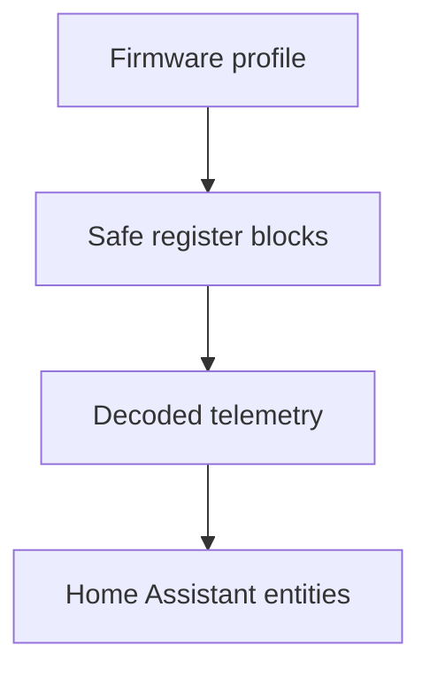

# Siemens SENTRON Integration Architecture

Version `V26.09.08` keeps four device domains deliberately separated.

## Root and child domains

1. Powercenter root gateways
   - Powercenter 1000, 1100 and 2000
   - Gateway Modbus unit ID `255`
   - Gateway register addresses use Siemens register minus one
   - Gateway-only diagnostics stay on the root device

2. PAC2200 root devices
   - Standalone root device, not a Powercenter gateway
   - PAC2200 Modbus unit ID `1`
   - Own data model in `pac2200.py`
   - Own root-device locate command through the display-backlight function

3. VersiCharge root devices
   - Standalone VersiCharge AC Gen3, with no Powercenter child discovery
   - Configurable Modbus unit ID; onboarding defaults to `2` and retries `1`
   - Own identification, telemetry, firmware adaptation and conversion model in
     `versicharge.py`
   - Ten-second read-only polling and a five-second Modbus request timeout;
     immutable identity and configuration values come from initial discovery
   - The single `0.1 kW` target remains a Home Assistant abstraction. The
     physical Modbus command is always one validated whole-ampere setpoint

4. Powercenter end devices
   - Slot/unit-ID-based devices behind a Powercenter
   - Profiles stay in `profiles.py` / `const.py` and are not mixed with either
     standalone root-device dataset
   - End-device locate commands use the end-device Modbus unit ID

## Root detection

The setup flow probes a single host and port and classifies exactly one root
device. A stored root kind is preferred on later starts, while discovery can
recover if a migrated entry lacks that metadata. VersiCharge detection requires
plausible Siemens identity and charger-specific static fields so that another
Siemens Modbus device is not accepted accidentally.

For a default VersiCharge setup, unit `2` is tried first and unit `1` second. If
the user enters another unit ID, that configured address is authoritative. The
detected unit ID is retained on the config entry and root device.

## VersiCharge data path

The coordinator reads only documented register blocks and does not bridge gaps
that differ between firmware generations. All code addresses are zero-based
Modbus PDU offsets.

The A8 firmware string selects separate scaling and state profiles. If the
firmware cannot be parsed, current-map measurement semantics are assumed
conservatively; a newer-only extension block can positively confirm modern
command behavior. The phase register is never made writable.

| Behavior | Legacy firmware below 2.135 | Firmware 2.135 and newer |
| --- | --- | --- |
| Total-energy scale | raw × `0.0001 kWh` | raw × `0.001 kWh` |
| Power-factor scale | raw × `0.01` | raw × `0.001` |
| Direct current target exposed by HA | None | None |
| kW-target conversion | Nominal `230 V × phases`, rounded to whole amperes | Nominal `230 V × phases`, rounded to whole amperes |
| Current-register decoding | Whole amperes | Whole amperes; encoded hundredths decoded defensively |
| Phase mode | Observed only by this integration | Siemens marks the register read-only |

Firmware `2.136` also changes EVSE states and the error-code table. A separate
state profile applies those semantics, so firmware `2.135` uses modern scaling
while retaining the legacy state/error table.

## Virtual active-power target

VersiCharge has no native power setpoint. The single virtual number entity
accepts `kW` in `0.1 kW` steps and converts each accepted target once:

\[
I_{target} = \operatorname{round\_half\_up}
\left(\frac{P_{target,kW}\times1000}{230\times n_{phases}}\right)
\]

Stable bounds are calculated from the charger phase type reported by read-only
register `1642`, nominal `230 V`
and the `6 A` through installation-current rating. The maximum falls back to
rated current and then `16 A` when needed. The whole-ampere result is valid for
both supported register-map generations. Live voltage, power factor and actual
power and phase-current samples remain read-only monitoring data and never feed
the conversion or trigger a command. If the charger phase type cannot be
established, the number entity is unavailable instead of assuming one phase.

The coordinator remembers the last valid kW target for the lifetime of the
loaded config entry so the charging switch can map `off` to `0 A` and resume to
that target. After an entry reload it initializes the value once from a valid
active current limit, or otherwise from the minimum nominal kW target. Later
telemetry and register reads never back-convert current into the user target.
The requested value is not presented as measured power; closed-loop automations
must use the live active-power sensor as feedback.

The editable kW target ignores coordinator updates caused only by changing
telemetry or register freshness. This prevents the polling cycle from redrawing
and clearing a value while it is being typed. Target, stable availability,
phase and installation-limit changes still republish the control.

## Timing and command isolation

- VersiCharge live data: every `10 s`, read-only
- Modbus request timeout: `5 s`
- Immutable VersiCharge identification and configuration: initial discovery
- Current-limit command: one FC06 write, positive acknowledgement, no retry,
  sleep or immediate readback
- Fallback current/time pair: one atomic FC16 write and positive
  acknowledgement, without immediate readback
- Command hard deadline: `12 s`
- Physical power-target writes and resume start-to-start limit: `5 s`; pause
  and fallback may bypass the interval but not the fail-fast guard
- Local-only target changes: separate `5 s` limiter that does not delay resume
- A single fail-fast command guard rejects concurrent callers; it creates no
  waiter queue and is not shared with polling
- Cumulative energy suppresses isolated lower readings and restores the last
  published value after an entry reload; three increasing readings below the
  old value confirm a genuine meter reset

These values respect the current map’s minimum five-second timeout and minimum
two-second polling interval. They do not guarantee that a cloud/OCPP backend
will accept local charge control.

## Core files

- `device_types.py`: normalized root/end-device classification
- `discovery.py`: Powercenter child discovery
- `gateway.py`: root probing and root metadata
- `pac2200.py`: PAC2200 entity/register definitions only
- `versicharge.py`: VersiCharge maps, decoding, firmware behavior and
  power/current conversion
- `sensor.py`: root and child sensor entities
- `number.py`: guarded numeric configuration and VersiCharge targets
- `switch.py`: guarded operational switches, including VersiCharge pause/resume
- `button.py`: test/unpair button entities
- `coordinator.py`: shared polling/runtime state and fail-fast command effects

## Design rules

- Never add VersiCharge registers to Powercenter or PAC2200 datasets.
- Never add Powercenter gateway registers to standalone-root datasets.
- Select unit ID, poll timing and register blocks from the detected root kind.
- Keep names translation-key based so German and English labels remain stable.
- Expose destructive reset, factory-reset and RFID-list writes through neither
  generic entities nor diagnostic shortcuts.
- Keep every VersiCharge write entity disabled by default and require a positive
  Modbus acknowledgement.
- Treat phase mode as observation only; no automatic 1/3-phase switching is
  claimed by this integration.
